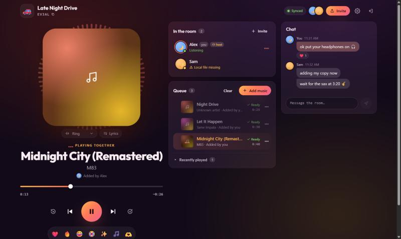
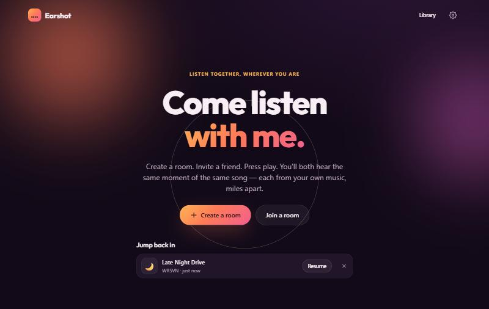
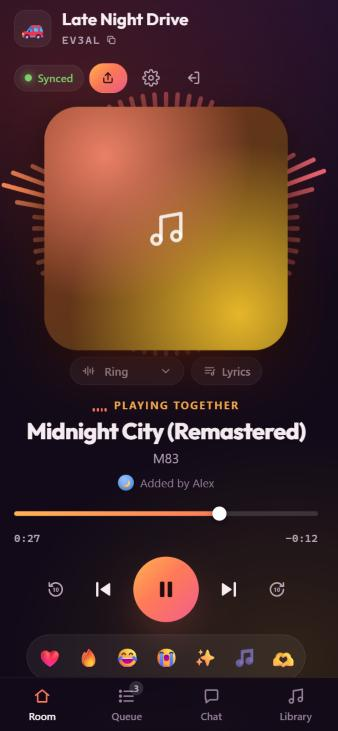
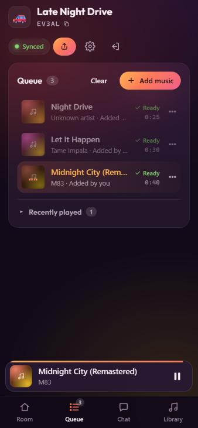

<div align="center">

# 🎧 Earshot

### *Come listen with me.*

Listen to music together, in sync, from anywhere.<br>
Everyone plays their **own** copy of each song, and your music is never uploaded to Earshot.

[](LICENSE)


### **▶ [Try it live: earshot-30yv.onrender.com](https://earshot-30yv.onrender.com)**
<sub>Free hosting: the first visit after a quiet spell can take about a minute to wake up.</sub>



</div>

---

## What is Earshot?

Earshot is a **shared listening room**. You open a room, send your friend a link, and press play. You both hear the same moment of the same song, even if you're in different cities.

Unlike streaming services, Earshot doesn't stream anything. **Each person plays the song from their own device.** Earshot only keeps everyone's players in step: what's playing, whether it's paused, and where the song is. It works with the music you already own: MP3, FLAC, AAC/M4A, OGG, WAV and more.

- 🔒 **Private by design.** Your audio files are never uploaded to Earshot. (You can choose to send songs you have the rights to straight to a friend; see the FAQ.)
- ⚡ **Tightly in sync.** Listeners stay within a few tens of milliseconds of each other and correct themselves continuously.
- 💬 **Feels like hanging out.** See who's listening, react to the drop, chat, and build the queue together.

## ✨ Features

| | |
|---|---|
| 🎵 **Synced playback** | Play, pause, seek and skip for everyone at once; the buttons answer instantly. Swipe the artwork for the next song. Late joiners land at the right moment. |
| 👥 **Presence** | See who's here and whether each friend is *Ready* or still needs the song. |
| 📚 **Your library, saved** | Drop in files or whole folders. Tags and album art are read in your browser and remembered next visit. |
| 🔍 **Smart matching** | Your file doesn't have to be byte-identical. Earshot spots *"that's the same song"* and asks before using it. |
| 📋 **Shared queue** | Now playing on top, then *Next up* with the total time. On phones, swipe a song left to remove it (with Undo) or right to play it next, and press and hold to drag it. Everyone sees the same order instantly. |
| ❤️ **Reactions & chat** | Reactions rise across everyone's screen with your name, and **+** opens any emoji. The chat has bubbles, double-tap to ❤️, press and hold to react, reply or copy, swipe to reply, “Seen” and typing dots. |
| 🌈 **Song colours & visuals** | The room takes on each song's colours from its artwork. *Ambient* washes the whole screen in them, swelling with the music; *Ring* hugs the cover. Computed only on your device. |
| 🎤 **Synced lyrics** | Add a `.lrc` lyrics file and the lines light up in time with the room. |
| 👑 **Host controls** | Choose who can control playback or edit the queue, and turn chat or reactions on or off. Tap anyone for their profile: hand over host, or remove someone. |
| 📱 **Great on phones** | Install it like an app, keep listening with the screen locked, and use lock-screen controls. Bottom tabs, a mini-player that follows you around, and big touch-friendly controls. |

<div align="center">
<br><br>

&nbsp;&nbsp;

</div>

---

## 🚀 Run it in 1 minute

You need [Node.js](https://nodejs.org) **22.18 or newer**.

```bash
git clone https://github.com/shankartce/earshot.git
cd earshot
npm install
npm run dev
```

Open **http://localhost:5173** and create a room.

> **Try it alone first:** in a room, open **Invite → "Open as Sam in a new tab"**. The new tab is a second person with their own library, so you can watch the two stay in sync.

---

## 🎶 How to use Earshot

### 1. Create a room
Click **Create a room**. Give it a name and an emoji (like *🚗 Late Night Drive*), then pick your display name and avatar. You'll get a short **room code** like `F7K9Q`.

### 2. Invite your friends
Click **Invite** to copy the link (for example `https://your-earshot.app/room/F7K9Q`) or share the code. Friends open the link, pick a name, and they're in. There are no accounts or sign-ups.

### 3. Add your music
Click **+ Add music**:
- **Files / folders:** drop them in, or pick them. Tags and album art are read automatically.
- **Library:** anything you've added before (it's remembered in your browser).
- **Playlists:** queue a whole playlist you made on the **Library** page.

Only the song's *details* (title, artist, length and a fingerprint) are shared with the room. **The audio stays on your device.**

### 4. Press play ▶
Everyone hears the same moment. If your browser asks, tap **"Tap to tune in"** once; browsers need one tap before they're allowed to play sound.

### 5. Hang out
- React with ❤️ 🔥 😂 😭 ✨ 🎵 🫶. Your reaction floats up on everyone's screen.
- Chat in the side panel (on phones, use the **Chat** tab).
- Switch the **visualizer** under the artwork, or open **Lyrics**.
- Tap **⋯** on any queued song to *Play now*, *Play next*, move it, or remove it. On a computer you can also drag songs.

### When a friend doesn't have the song
That's fine. Nobody's music stops:
- Friends who have it keep listening. Your friend sees **"This song isn't available on your device yet"**, and everyone else sees *"Local file missing"* next to their name.
- They click **Add file** and pick their copy. If it's the same file, they join in right where the room is: *"You're ready — syncing with the room…"*.
- If it's a **different copy** of the same song (a different rip or a remaster), Earshot asks *"Is this the same song?"*. After **Use my copy**, it remembers the choice.

### Being the host
Whoever creates the room is the host (👑). In **⚙ Room settings** the host can choose:

| Setting | Options |
|---|---|
| Playback control | Host only / Everyone |
| Queue editing | Host only / Everyone (people can always add songs and remove their own) |
| Chat / Reactions | On / Off |

If the host leaves, hosting passes to whoever has been in the room longest.

### Install it like an app
In Chrome, Edge or Android, use **Install** in the address bar or menu. On iPhone, tap **Share → Add to Home Screen**. Earshot then opens full-screen with its own icon, and music keeps playing with the screen locked. If you unplug your headphones or take a call, it pauses on your device only and waits for you to tap **Resume listening**.

### Coming back later
Rooms are remembered for 7 days. The home page shows **Jump back in**, which returns you to your rooms as the same person, with the queue and chat where you left them.

### Keyboard shortcuts
<kbd>Space</kbd>/<kbd>K</kbd> play/pause · <kbd>J</kbd>/<kbd>L</kbd> back/forward 10 s · <kbd>N</kbd>/<kbd>P</kbd> next/previous · <kbd>Alt</kbd>+<kbd>↑</kbd>/<kbd>↓</kbd> move the focused song in the queue

---

## ❓ FAQ

<details>
<summary><b>Does Earshot upload or stream my music?</b></summary>

No. There's no upload feature at all, and nothing is ever sent to Earshot's server. Your files stay in your browser's private storage on your device. The server only learns song details such as *"Midnight City – M83, 4:03"* plus a fingerprint (a SHA-256 hash of the file), and who pressed play.
</details>

<details>
<summary><b>Can a friend get a song from me?</b></summary>

Only for music you have the right to share: your own recordings, or songs under Creative Commons or in the public domain. Open the song's **⋯** menu and choose **Let friends get a copy…**, pick the licence, and confirm you have the right to share it. Friends missing that song get it automatically in the background (or tap **Get a copy**), straight from your browser to theirs. It never passes through Earshot's server, it's checked to be the exact same file, and it stays in their library under **Shared with me**, labelled with who shared it and the licence.

If everything you add is yours to share (say, you're a musician), turn on **⚙ Settings → Share songs I add automatically**. You confirm once and pick the licence, and from then on every song you add to your library or a queue is shared with no extra taps. It's off by default, and songs friends shared with you are never passed on.

**Sharing policy:** don't share songs you bought, streamed or ripped from CDs; that's copyright infringement in most countries. Earshot can't verify licences; the person sharing is responsible. Direct connections don't work on every network (some mobile carriers and office networks block them).
</details>

<details>
<summary><b>Why does everyone need their own copy?</b></summary>

Sharing audio between people would mean redistributing music, which Earshot doesn't do. Everyone brings music they already have; Earshot makes sure you all hear it at the same time.
</details>

<details>
<summary><b>My friend has the "same" song but it shows as missing.</b></summary>

Files are matched by their exact contents first. If your friend has a different rip, Earshot suggests it as a match when the title, artist and length (within 2 seconds) line up. They confirm with **Use my copy**. If the tags are very different, renaming the file to `Artist - Title.mp3` helps.
</details>

<details>
<summary><b>It sounds slightly out of sync with my Bluetooth headphones.</b></summary>

Bluetooth adds its own delay. Open **⚙ Settings → Speaker delay** and slide it up (100–250 ms is typical) until it lines up.
</details>

<details>
<summary><b>It works on my computer but not on my phone over Wi-Fi.</b></summary>

Browsers only allow the features Earshot needs (reading files, storing them, playing through Web Audio) on **secure (HTTPS) pages**. `http://localhost` counts as secure, but `http://192.168.x.x` does not. Use a free HTTPS tunnel such as `cloudflared tunnel --url http://localhost:5173`, or [host it](#-host-it-for-your-friends).
</details>

<details>
<summary><b>Some of my songs disappeared from my library.</b></summary>

Browsers may clear a site's stored files when the device runs low on space, unless the site is granted "persistent" storage. Earshot tells you which songs were cleared; just add the files again. Keep your original music files somewhere safe.
</details>

<details>
<summary><b>Which browsers work?</b></summary>

Earshot is built for recent Chrome, Edge, Firefox and Safari, on desktop and phone. So far it has been tested mainly in Chrome; if something misbehaves in your browser, please [open an issue](../../issues). On iPhone, keep the tab in front: iOS may pause audio in the background, and Earshot re-syncs as soon as you're back.
</details>

<details>
<summary><b>Is there a size limit on rooms?</b></summary>

Rooms are designed for small groups of friends and allow up to 50 people. The queue holds up to 500 songs.
</details>

---

## 🌍 Host it for your friends

Earshot is a single Node.js app. Anywhere that runs Node with **WebSockets** and **HTTPS** works: Render, Fly.io, Railway, or a small VPS. (Serverless function platforms don't fit, because rooms live in one long-running server.)

```bash
npm install
npm run build
npm start          # serves the app + realtime server on $PORT (default 3000)
```

| Environment variable | Default | What it does |
|---|---|---|
| `PORT` | `3000` | Port to listen on |
| `DATA_FILE` | `data/rooms.json` | Where rooms are saved. Put it on a persistent disk so rooms survive restarts. |

**Render example:** create a *Web Service* from this repo with build command `npm install && npm run build`, start command `npm start`, and optionally a persistent disk mounted at `/data` with `DATA_FILE=/data/rooms.json`.

---

## 🛠 For developers

```bash
npm run dev         # app + realtime server in one process (http://localhost:5173)
npm test            # 115 unit + multi-client integration tests (Vitest)
npm run typecheck   # TypeScript
npm run build       # production client → dist/
npm start           # production server (serves dist/)
```

**Stack:** Preact + Signals + Vite on the client; Express + Socket.IO on the server. The server runs `.ts` files directly on Node 22.18+, with no build step for it. Tag reading uses [music-metadata](https://github.com/Borewit/music-metadata), loaded only when needed.

### How the sync works
- **The server owns the timeline.** Playback is `{ itemId, isPlaying, position, serverTimestamp, version }`. Where the song is at any moment follows from that, using the server's clock only ([`shared/playback.ts`](shared/playback.ts)).
- **Clock sync.** Each client pings the server 5 times, keeps the fastest round trip to estimate its clock offset, and repeats every 30 s and on wake-up ([`src/sync/clock.ts`](src/sync/clock.ts)).
- **Drift correction** runs about once a second and puts clean sound ahead of precision ([`src/sync/drift.ts`](src/sync/drift.ts)):
  - under 300 ms: nothing (the music is never touched for it);
  - 300 ms–2 s, seen twice in a row: play 2% faster or slower (pitch preserved) until within 80 ms, then back to normal. The speed changes only twice per correction, never in the background;
  - over 2 s: seek, aiming ahead by a seek delay learned per device;
  - songs start exactly in step: the seek happens before the sound does.
- **No race conditions.** Every command carries the version it was based on. If two people press at once, the first wins and the second is told it was too late. The server also moves on by itself if nobody reports that a song ended.

### Project layout
```
shared/    types, typed socket events, input validators, playhead math (used by both sides)
server/    app.ts (HTTP + security headers) · state/room.ts (pure room logic)
           rooms/store.ts (memory + JSON snapshot) · websocket/handlers.ts · rateLimit.ts
src/       audio/ (sync player, visualizer) · sync/ · library/ (storage, hashing worker,
           tags, matching) · share/ (rights-gated WebRTC sharing) · lyrics/ · state/ ·
           components/ · pages/ · styles/
tests/     room logic, sync math, matching, tag parsing, lyrics, HTTP, multi-client scenarios
```

See [`CLAUDE.md`](CLAUDE.md) for the design rules the project must keep: audio never touches the server, the server is authoritative, and every command is versioned.

### Contributing
Issues and pull requests are welcome. Please run `npm test` and `npm run typecheck` before opening a PR, and keep the golden rule: **audio never touches the server.**

---

## 🔒 Privacy & security

- No upload endpoints. The server only accepts page loads over HTTP; everything else happens over the realtime connection, with messages capped at 256 KB.
- Every message is validated and rate-limited. Chat is shown as plain text only, never as HTML.
- Your seat in a room is a private token kept in your browser, never shown to others.
- A strict Content Security Policy and related headers are sent on every page.
- Visualizers and lyrics are computed on your device.

## 📄 License

[MIT](LICENSE) © 2026 shankartce

<div align="center"><sub>Made for listening together. 🎧</sub></div>
